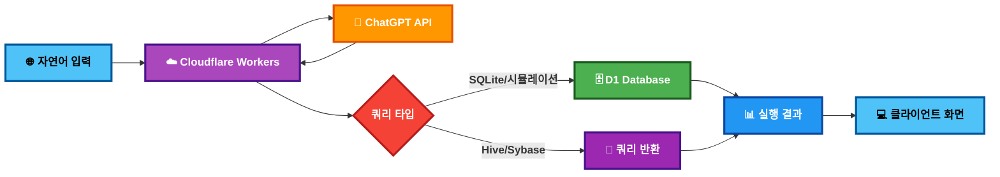

# CoP_TTSQL

## 🔄 시스템 작동 Flow



### 🔐 보안 특징
- **API 키**: 서버 환경변수 관리
- **민감정보**: Git 추적 차단
- **통신**: HTTPS 암호화

---

## 프로젝트 개요
**CoP_TTSQL**은 자연어를 다양한 SQL 방언으로 변환하는 AI 기반 Text-to-SQL 서비스입니다.

### 🎯 주요 특징
- **5가지 SQL 방언 지원**: SQLite, Hive, Sybase
- **실시간 쿼리 실행**: Cloudflare D1에서 즉시 결과 확인
- **폐쇄망 환경 시뮬레이션**: 실제 기업 환경 경험
- **ChatGPT API 연동**: 자연어 처리 및 SQL 생성

### 🛠️ 기술 스택
- **Frontend**: HTML5, CSS3, Vanilla JavaScript
- **Backend**: Cloudflare Workers (Serverless)
- **Database**: Cloudflare D1 (SQLite 기반)
- **AI**: OpenAI ChatGPT API (GPT-3.5-turbo)
- **배포**: Cloudflare Pages

## 🔒 보안 설정

⚠️ **중요**: 민감정보 파일들은 `.gitignore`에 포함되어 Git에 업로드되지 않습니다.

### 설정 파일 생성

1. **API 설정**:
   ```bash
   copy config.example.js config.js
   ```
   그리고 `config.js`에서 OpenAI API 키를 설정하세요.

2. **Cloudflare 설정**:
   ```bash
   copy wrangler.example.toml wrangler.toml
   ```
   그리고 `wrangler.toml`에서 계정 ID와 데이터베이스 ID를 설정하세요.

3. **환경변수 설정** (중요한 보안 개선!):
   
   **개발환경**:
   ```bash
   wrangler secret put OPENAI_API_KEY
   # 또는 wrangler.toml의 [vars] 섹션에서 설정
   ```
   
   **프로덕션 환경**:
   ```bash
   wrangler secret put OPENAI_API_KEY --env production
   ```
   
   ⚠️ **중요**: API 키는 이제 서버 환경변수로 관리되어 클라이언트에 노출되지 않습니다.

### 🌐 링크
- **GitHub**: https://github.com/Jeong-jaehoon/CoP_TTSQL
- **배포**: Cloudflare Pages (자동 배포)

## 🚀 지원 기능

### 📊 5가지 쿼리 모드

#### 1. 🗄️ SQLite 모드
- **기능**: 표준 SQLite 쿼리 생성 및 실행
- **용도**: 기본 SQL 학습 및 테스트
- **실행**: Cloudflare D1에서 즉시 실행

#### 2. 🏭 Hive SQL 모드
- **기능**: Hadoop 기반 Hive 쿼리 생성
- **용도**: 빅데이터 환경 쿼리 학습
- **실행**: 쿼리만 생성 (실제 Hive 클러스터 필요)

#### 3. ⚡ Hive 시뮬레이션 모드
- **기능**: Hive SQL → SQLite 변환 후 실행
- **용도**: Hive 환경 없이도 결과 확인 가능
- **실행**: D1에서 시뮬레이션 실행

#### 4. 🏢 Sybase SQL 모드
- **기능**: 기업용 Sybase SQL 쿼리 생성
- **용도**: 전통적인 기업 RDBMS 환경 학습
- **실행**: 쿼리만 생성 (실제 Sybase 서버 필요)

#### 5. 🔧 Sybase 시뮬레이션 모드
- **기능**: Sybase SQL → SQLite 변환 후 실행
- **용도**: Sybase 환경 없이도 결과 확인 가능
- **실행**: D1에서 시뮬레이션 실행

### 🔄 SQL 변환 엔진

#### Hive → SQLite 변환
- 데이터 타입 변환 (`STRING` → `TEXT`, `BIGINT` → `INTEGER`)
- 함수 변환 (`collect_list()` → `group_concat()`)
- 날짜 함수 변환 (`year()` → `strftime()`)
- 문법 정리 (백틱 제거, 주석 제거)

#### Sybase → SQLite 변환
- 데이터 타입 변환 (`VARCHAR` → `TEXT`, `MONEY` → `REAL`)
- 함수 변환 (`ISNULL()` → `IFNULL()`, `GETDATE()` → `datetime('now')`)
- 문자열 함수 변환 (`LEN()` → `length()`, `CHARINDEX()` → `instr()`)
- 문법 변환 (`SELECT TOP N` → `LIMIT`, `[column]` → `column`)

## 📁 프로젝트 구조

```
CoP_TTSQL/
├── 📄 index.html          # 메인 UI (3컬럼 레이아웃)
├── 📄 config.js           # API 키 및 설정
├── 📄 api.js              # API 호출 로직
├── 📁 src/
│   └── 📄 worker.js       # Cloudflare Workers API
├── 📄 wrangler.toml       # Workers 배포 설정
├── 📄 schema.sql          # 데이터베이스 스키마
├── 📄 seed.sql            # 샘플 데이터
├── 📄 package.json        # 프로젝트 설정
└── 📄 README.md           # 프로젝트 문서
```

## 🗄️ 데이터베이스 구조

### 테이블 설계
- **employees**: 직원 정보 (10명)
- **departments**: 부서 정보 (4개)
- **projects**: 프로젝트 정보 (5개)
- **employee_projects**: 직원-프로젝트 관계 (10개 관계)

### 샘플 데이터
- 한국 기업 환경을 모델링한 현실적인 데이터
- 급여, 부서, 프로젝트 예산 등 실제 비즈니스 시나리오

## 🎨 사용자 인터페이스

### 반응형 3컬럼 레이아웃
- **왼쪽**: 데이터베이스 스키마 정보
- **중앙**: 자연어 입력 및 SQL 결과
- **오른쪽**: 예제 쿼리 목록

### 동적 UI 기능
- 쿼리 타입별 색상 테마
- 실시간 모드 정보 업데이트
- 변환된 SQL 쿼리 확인 가능
- 실행 시간 및 메타 정보 표시

## 🚀 사용 방법

1. **쿼리 타입 선택**: 5가지 모드 중 선택
2. **자연어 입력**: "급여가 5000만원 이상인 직원들을 보여주세요"
3. **쿼리 생성**: ChatGPT가 적절한 SQL 생성
4. **결과 확인**: 실시간으로 실행 결과 또는 생성된 쿼리 확인

## 📈 성능 및 제약사항

- **데이터베이스 크기**: 36.9 kB (Cloudflare D1 무료 한도 내)
- **API 제한**: OpenAI API 사용량에 따른 비용
- **쿼리 복잡도**: 중간 복잡도까지 지원
- **동시 사용자**: Cloudflare Workers 확장성